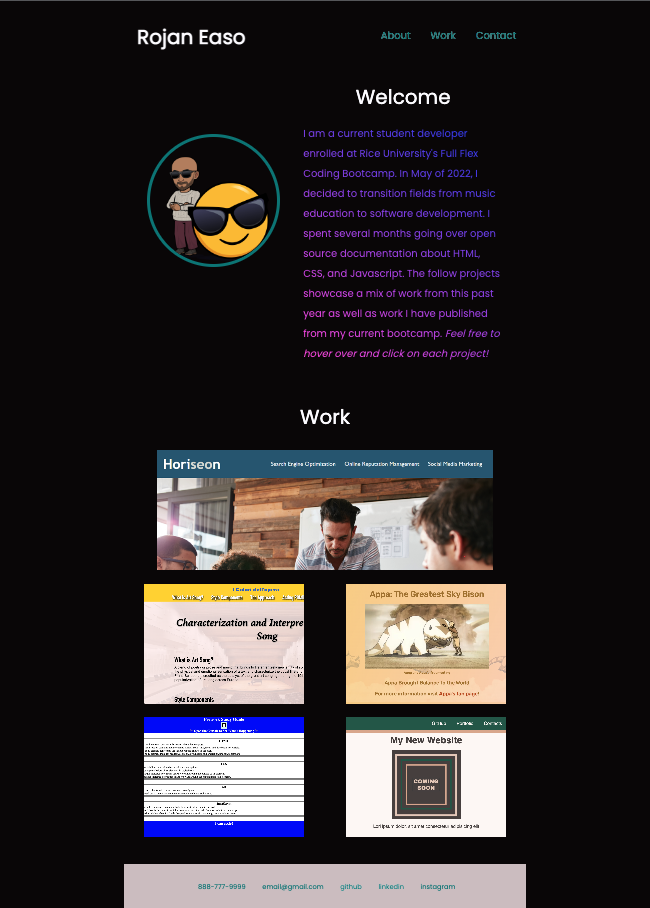

/*module_2_css_portfolio*/

# Rice Bootcamp Module 2: Advanced CSS Portfolio

## User Story
AS AN employer  
I WANT to view a potential employee's deployed portfolio of work samples  
SO THAT I can review samples of their work and assess whether they're a good candidate for an open position  

## Features
Primarily, I've included extensive work with Flexbox, Media Queries and CSS styling to highlight my projects thus far. 
## Mock-Up

 
Deployed Project: https://robobrownie13.github.io/module_2_css_portfolio/